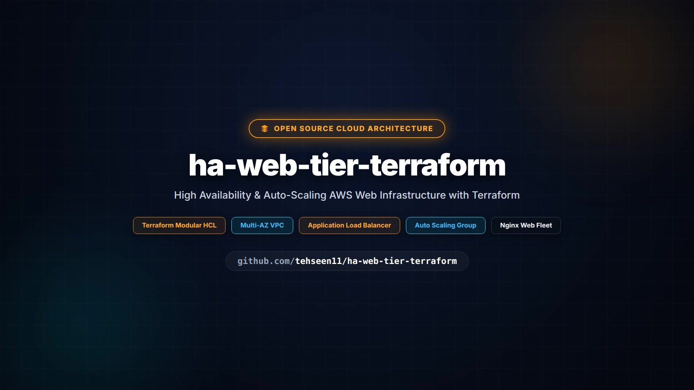

# 🚀 Highly Available Web Tier on AWS with Terraform
## 🎥 Project Demo

Watch the complete infrastructure walkthrough:

[](YOUR_VIDEO_LINK)(./brag.mp4)

The demo covers the AWS VPC architecture, public/private subnets,
security groups, load balancing, EC2 instances, and Terraform deployment.

<p align="center">
  
  
  
  
</p>

<p align="center">
  <b>Production-style highly available web infrastructure built on AWS using Terraform.</b>
</p>

---

## 📌 Project Overview

This project demonstrates how to deploy a **highly available web tier on AWS using Terraform Infrastructure as Code (IaC)**.

The architecture uses an **Application Load Balancer (ALB)** to distribute HTTP traffic across EC2 instances running in multiple Availability Zones.

An **Auto Scaling Group (ASG)** maintains the desired number of web servers and can scale the infrastructure when required.

Each EC2 instance automatically installs and starts **Nginx** using a Terraform-managed User Data script.

### 🎯 Main Objectives

* Build AWS infrastructure using Terraform
* Create a custom VPC and public subnets
* Deploy resources across multiple Availability Zones
* Configure an Application Load Balancer
* Deploy EC2 instances using Launch Templates
* Configure an Auto Scaling Group
* Implement ALB health checks
* Secure the web tier using Security Groups
* Use reusable Terraform modules
* Test the application through the ALB DNS endpoint

---

# 🏗️ Architecture

```text
                         🌍 INTERNET
                              |
                              |
                              v
                 ┌────────────────────────┐
                 │ Application Load       │
                 │ Balancer (ALB)         │
                 │ HTTP : 80              │
                 └───────────┬────────────┘
                             |
                  ┌──────────┴──────────┐
                  |                     |
                  v                     v
        ┌──────────────────┐   ┌──────────────────┐
        │ Public Subnet    │   │ Public Subnet    │
        │ us-east-1a       │   │ us-east-1b       │
        │                  │   │                  │
        │ EC2 + Nginx      │   │ EC2 + Nginx      │
        └────────┬─────────┘   └─────────┬────────┘
                 |                       |
                 └───────────┬───────────┘
                             |
                             v
                  ┌──────────────────────┐
                  │  Auto Scaling Group  │
                  │                      │
                  │  Minimum: 2          │
                  │  Desired: 2          │
                  │  Maximum: 4          │
                  └──────────────────────┘

                  ┌──────────────────────┐
                  │        AWS VPC       │
                  │    10.0.0.0/16       │
                  └──────────────────────┘
```

---

# 🔄 Request Flow

A user's HTTP request follows this path:

```text
User
  |
  v
Internet
  |
  v
Application Load Balancer
  |
  +----------------------+
  |                      |
  v                      v
EC2 Instance 1       EC2 Instance 2
us-east-1a           us-east-1b
Nginx                Nginx
```

The ALB distributes incoming traffic between healthy EC2 instances.

---

# ☁️ AWS Architecture Components

| Component                 | Purpose                                   |
| ------------------------- | ----------------------------------------- |
| VPC                       | Provides isolated AWS networking          |
| Internet Gateway          | Provides internet connectivity            |
| Public Subnets            | Host ALB and EC2 instances                |
| Route Table               | Routes internet traffic                   |
| Security Groups           | Controls inbound and outbound traffic     |
| Application Load Balancer | Distributes HTTP traffic                  |
| Target Group              | Registers and health-checks EC2 instances |
| ALB Listener              | Accepts HTTP traffic on port 80           |
| Launch Template           | Defines EC2 configuration                 |
| Auto Scaling Group        | Maintains and scales EC2 instances        |
| EC2                       | Runs the web server                       |
| Nginx                     | Serves the web application                |

---

# 🌎 Network Configuration

## VPC

```text
CIDR: 10.0.0.0/16
```

## Availability Zones

```text
us-east-1a
us-east-1b
```

## Public Subnets

```text
Subnet 1
CIDR: 10.0.1.0/24
AZ: us-east-1a

Subnet 2
CIDR: 10.0.2.0/24
AZ: us-east-1b
```

## Internet Connectivity

```text
                    Internet
                       |
                       v
              Internet Gateway
                       |
                       v
                Route Table
                       |
             +---------+---------+
             |                   |
             v                   v
       Public Subnet 1     Public Subnet 2
       10.0.1.0/24        10.0.2.0/24
```

---

# ⚖️ High Availability

The application is deployed across two Availability Zones.

```text
                  Application Load Balancer
                            |
                 +----------+----------+
                 |                     |
                 v                     v
            us-east-1a            us-east-1b
                 |                     |
                 v                     v
             EC2 + Nginx           EC2 + Nginx
```

If one EC2 instance becomes unhealthy, the ALB health check detects the failure and stops sending traffic to that instance.

The Auto Scaling Group can also launch a replacement instance.

---

# 📈 Auto Scaling

The Auto Scaling Group is configured with:

```text
Minimum Capacity : 2
Desired Capacity : 2
Maximum Capacity : 4
```

This means:

```text
Normal State

        EC2
         |
    +----+----+
    |         |
    v         v
  EC2-1     EC2-2


Scale Out

    EC2-1
    EC2-2
    EC2-3
    EC2-4
```

The architecture is designed to support horizontal scaling by adding additional EC2 instances when capacity requirements increase.

---

# ❤️ Load Balancer Health Checks

The ALB Target Group performs HTTP health checks against:

```text
Path: /
Port: Traffic Port
Protocol: HTTP
Expected Response: 200
```

Traffic is routed only to healthy targets.

Example:

```text
ALB
 |
 +---- EC2 1 → Healthy → Receive Traffic
 |
 +---- EC2 2 → Healthy → Receive Traffic
 |
 +---- EC2 3 → Unhealthy → No Traffic
```

---

# 🔐 Security Design

The infrastructure uses separate Security Groups for the ALB and web servers.

## ALB Security Group

The ALB accepts:

```text
HTTP  : 80  → Internet
HTTPS : 443 → Internet
```

## Web Security Group

The EC2 instances accept HTTP traffic only from the ALB Security Group.

```text
Internet
   |
   | HTTP :80
   v
+----------------------+
| ALB Security Group   |
+----------------------+
           |
           | HTTP :80
           v
+----------------------+
| Web Security Group   |
+----------------------+
           |
           v
       EC2 + Nginx
```

This avoids exposing the web server directly to arbitrary internet traffic on port 80.

---

# 🖥️ Application Deployment

EC2 instances are automatically configured using:

```text
user-data.sh
```

The User Data script performs the following:

1. Updates Amazon Linux packages
2. Installs Nginx
3. Enables Nginx
4. Starts Nginx
5. Creates the application homepage

Example:

```html
<h1>Highly Available Web Application</h1>
<p>Terraform + AWS ALB + Auto Scaling</p>
<p>Instance: hostname</p>
```

The hostname is included to demonstrate that requests can be served by different instances behind the ALB.

---

# 🧩 Terraform Module Architecture

The project is divided into reusable Terraform modules.

```text
Root Module
    |
    +----------------+
    |                |
    v                v
  VPC Module      ALB Module
    |                |
    |                |
    +--------+-------+
             |
             v
        Web Module
             |
             v
       Auto Scaling
             |
             v
        EC2 Instances
```

## VPC Module

Creates:

* VPC
* Internet Gateway
* Public Subnets
* Public Route Table
* Route Table Associations

## ALB Module

Creates:

* ALB Security Group
* Application Load Balancer
* Target Group
* HTTP Listener
* Health Checks

## Web Module

Creates:

* Amazon Linux AMI lookup
* Web Security Group
* Launch Template
* Auto Scaling Group
* EC2 configuration

---

# 📁 Project Structure

```text
ha-web-tier-terraform/
│
├── main.tf
├── providers.tf
├── variables.tf
├── outputs.tf
├── terraform.tfvars.example
├── user-data.sh
├── .gitignore
├── README.md
│
└── modules/
    │
    ├── vpc/
    │   ├── main.tf
    │   ├── variables.tf
    │   └── outputs.tf
    │
    ├── alb/
    │   ├── main.tf
    │   ├── variables.tf
    │   └── outputs.tf
    │
    └── web/
        ├── main.tf
        ├── variables.tf
        └── outputs.tf
```

---

# 🛠️ Technologies Used

| Technology                | Usage                         |
| ------------------------- | ----------------------------- |
| AWS                       | Cloud infrastructure          |
| Terraform                 | Infrastructure as Code        |
| Amazon VPC                | Networking                    |
| Application Load Balancer | Load balancing                |
| EC2                       | Compute                       |
| Auto Scaling Group        | High availability and scaling |
| Security Groups           | Network security              |
| Nginx                     | Web server                    |
| Amazon Linux 2023         | Operating system              |
| Git                       | Version control               |
| GitHub                    | Source code management        |

---

# 🚀 Getting Started

## Prerequisites

Make sure the following are installed:

```text
AWS CLI
Terraform
Git
```

Verify Terraform:

```bash
terraform version
```

Verify AWS CLI:

```bash
aws --version
```

Verify AWS credentials:

```bash
aws sts get-caller-identity
```

---

# 1️⃣ Clone the Repository

```bash
git clone https://github.com/tehseen11/ha-web-tier-terraform.git

cd ha-web-tier-terraform
```

---

# 2️⃣ Configure AWS Credentials

Configure your AWS CLI:

```bash
aws configure
```

Verify:

```bash
aws sts get-caller-identity
```

> ⚠️ Never commit AWS credentials, access keys, secret keys, `.pem` files, or other sensitive information to GitHub.

---

# 3️⃣ Configure Terraform Variables

Create your local Terraform variables file:

```bash
cp terraform.tfvars.example terraform.tfvars
```

Example:

```hcl
aws_region  = "us-east-1"
environment = "prod"

vpc_cidr = "10.0.0.0/16"

public_subnet_cidrs = [
  "10.0.1.0/24",
  "10.0.2.0/24"
]

availability_zones = [
  "us-east-1a",
  "us-east-1b"
]
```

The actual `terraform.tfvars` file is intentionally excluded from Git.

---

# 4️⃣ Initialize Terraform

```bash
terraform init
```

---

# 5️⃣ Format Terraform Files

```bash
terraform fmt -recursive
```

---

# 6️⃣ Validate Configuration

```bash
terraform validate
```

Expected:

```text
Success! The configuration is valid.
```

---

# 7️⃣ Create Terraform Plan

```bash
terraform plan
```

Review the resources Terraform plans to create.

---

# 8️⃣ Deploy Infrastructure

```bash
terraform apply
```

Confirm:

```text
yes
```

Terraform will create:

```text
VPC
Internet Gateway
Subnets
Route Tables
Security Groups
Application Load Balancer
Target Group
Launch Template
Auto Scaling Group
EC2 Instances
```

---

# 📤 Terraform Outputs

After deployment:

```bash
terraform output
```

Important output:

```text
alb_dns_name
```

Example:

```text
prod-alb-xxxxxxxx.us-east-1.elb.amazonaws.com
```

---

# 🌐 Test the Application

Open the ALB DNS name in your browser:

```text
http://<ALB-DNS-NAME>
```

Or test using curl:

```bash
curl http://<ALB-DNS-NAME>
```

Expected response:

```text
Highly Available Web Application

Terraform + AWS ALB + Auto Scaling

Instance: ip-10-0-x-x.ec2.internal
```

Expected HTTP response:

```text
HTTP/1.1 200 OK
```

---

# 🔍 Verify Target Health

Get the Target Group ARN:

```bash
terraform output target_group_arn
```

Then check target health:

```bash
aws elbv2 describe-target-health \
  --target-group-arn <TARGET-GROUP-ARN>
```

Expected state:

```text
healthy
```

---

# 🔍 Verify Auto Scaling

Get the Auto Scaling Group name:

```bash
terraform output autoscaling_group_name
```

Then:

```bash
aws autoscaling describe-auto-scaling-groups
```

The desired capacity should be:

```text
2
```

---

# 🧪 Infrastructure Validation

The deployed infrastructure was tested using:

```text
Terraform Validate
       ↓
Terraform Plan
       ↓
Terraform Apply
       ↓
ALB Health Check
       ↓
Browser / curl
       ↓
HTTP 200 OK
```

The application successfully returned the Nginx web page through the Application Load Balancer.

---

# 🧹 Cleanup

To remove all resources created by Terraform:

```bash
terraform destroy
```

Confirm:

```text
yes
```

> ⚠️ `terraform destroy` permanently removes the infrastructure managed by this Terraform configuration.

---

# 🧠 Key DevOps Concepts Demonstrated

This project provides hands-on practice with:

```text
Infrastructure as Code
        ↓
Terraform Modules
        ↓
AWS VPC Networking
        ↓
Multi-AZ Architecture
        ↓
Application Load Balancer
        ↓
Security Groups
        ↓
EC2 Launch Templates
        ↓
Auto Scaling
        ↓
Health Checks
        ↓
Nginx Deployment
        ↓
Infrastructure Testing
```

---

# 📚 What I Learned

Through this project, I practiced:

* Designing AWS VPC networking
* Creating public subnets across Availability Zones
* Configuring Internet Gateway and routing
* Writing reusable Terraform modules
* Using Terraform variables and outputs
* Creating Application Load Balancers
* Configuring Target Groups and health checks
* Creating EC2 Launch Templates
* Deploying EC2 instances using User Data
* Configuring Auto Scaling Groups
* Designing Security Group relationships
* Testing AWS infrastructure using CLI and browser
* Managing Terraform infrastructure using Git and GitHub

---

# 🔮 Future Improvements

The following improvements can be added later:

* [ ] Private subnets for EC2 instances
* [ ] NAT Gateway
* [ ] HTTPS using AWS Certificate Manager
* [ ] Route 53 DNS
* [ ] CloudWatch monitoring
* [ ] CPU-based Auto Scaling policies
* [ ] AWS Systems Manager Session Manager
* [ ] Remote Terraform state using S3
* [ ] Terraform state locking
* [ ] GitHub Actions CI/CD
* [ ] Terraform security scanning using Checkov
* [ ] Separate Dev / Staging / Production environments

---

# 📊 Architecture Summary

```text
┌──────────────────────────────────────────────────────┐
│                       AWS VPC                        │
│                    10.0.0.0/16                       │
│                                                      │
│   ┌─────────────────┐    ┌─────────────────┐        │
│   │  us-east-1a     │    │  us-east-1b     │        │
│   │                 │    │                 │        │
│   │ EC2 + Nginx     │    │ EC2 + Nginx     │        │
│   │                 │    │                 │        │
│   └────────┬────────┘    └────────┬────────┘        │
│            │                      │                 │
│            └──────────┬───────────┘                 │
│                       │                             │
│              ┌────────▼────────┐                    │
│              │ Target Group    │                    │
│              └────────┬────────┘                    │
│                       │                             │
│              ┌────────▼────────┐                    │
│              │      ALB        │                    │
│              │    HTTP :80     │                    │
│              └────────┬────────┘                    │
└───────────────────────┼──────────────────────────────┘
                        │
                        ▼
                     Internet
```

---

# ⭐ Project Highlights

```text
✓ Infrastructure as Code
✓ Modular Terraform Design
✓ Multi-AZ Deployment
✓ Application Load Balancer
✓ Auto Scaling Group
✓ EC2 + Nginx
✓ ALB Health Checks
✓ Security Group Isolation
✓ Automated Server Configuration
✓ GitHub Version Control
```

---

# 👨‍💻 Author

## Tehseen Nayeem Khan

**DevOps / Cloud Engineer**

GitHub:

https://github.com/tehseen11

---

## ⭐ Repository

If you find this project useful, feel free to explore the Terraform modules and architecture.

```text
Terraform
    ↓
AWS VPC
    ↓
Application Load Balancer
    ↓
Target Group
    ↓
Auto Scaling Group
    ↓
EC2 + Nginx
```

---

**Built with Terraform + AWS ☁️**
